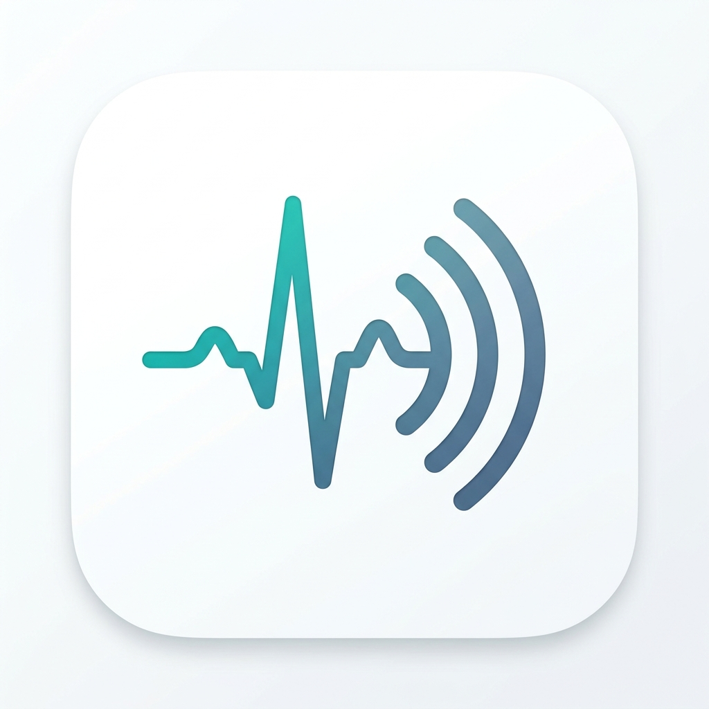
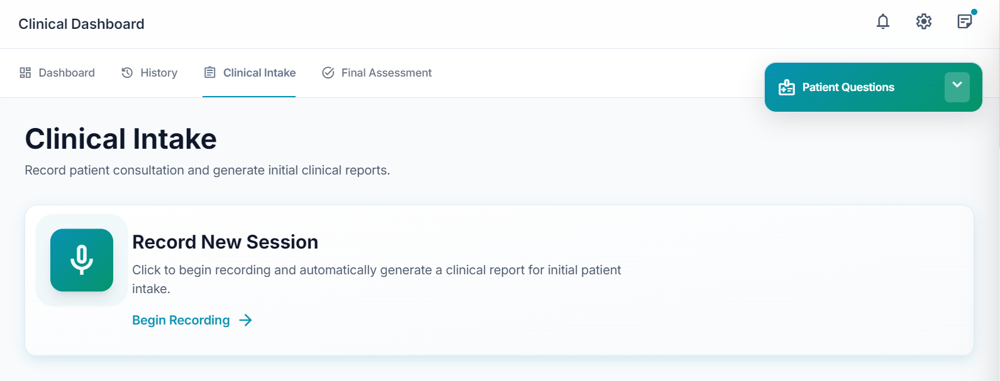
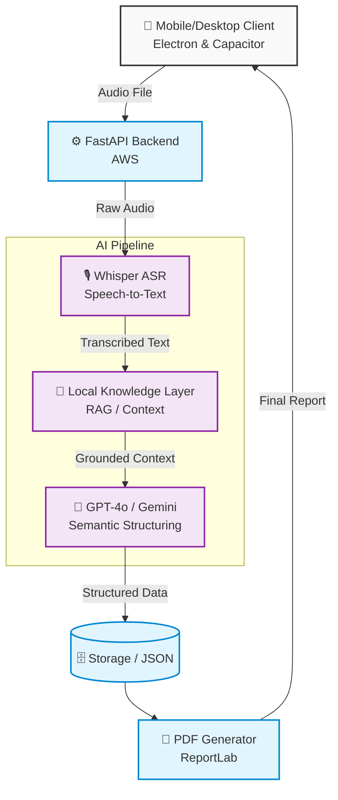

<div align="center">



# 🩺 MedEcho: AI-Powered Voice-to-Report System
**Clinical Precision. Mobile Speed. Artificial Intelligence.**

[](https://python.org)
[]()
[](https://fastapi.tiangolo.com/)
[](https://openai.com/)
[](https://aws.amazon.com)
[](LICENSE)

*An award-winning clinical documentation system designed to reduce physician burnout by converting spoken dictations into structured, OSCE-compliant medical reports.*

<br>

<br><br>

---

</div>

## 📖 Overview

Clinical documentation is a critical bottleneck in modern healthcare, consuming significant physician time and leading to burnout. **MedEcho** bridges the gap between raw generative AI capabilities and rigid clinical requirements.

By integrating OpenAI Whisper for robust multilingual automatic speech recognition (ASR) with large language models (LLMs), MedEcho transcribes, structures, and formats medical records in real-time. Evaluated in real-world clinical settings, MedEcho demonstrated an **80% reduction in documentation time**, requiring less than three minutes per report.

## 📂 Repository Structure

```text
📦 medical-report-ai
 ┣ 📂 assets/              # Images, icons, and screenshots for documentation
 ┣ 📂 archive/             # Archived legacy scripts and older versions
 ┣ 📂 backend/             # Python FastAPI backend (AI Pipeline & AWS APIs)
 ┣ 📂 docs/                # Technical documentation, system audits, and manuals
 ┃ ┗ 📂 thesis/            # LaTeX files for the university research thesis
 ┣ 📂 src/                 # Frontend Electron / Capacitor Source Code
 ┣ 📂 android/             # Android specific build files
 ┣ 📜 README.md            # This documentation
 ┗ 📜 requirements.txt     # Python backend dependencies
```

## ✨ Key Features

- 🎙️ **Multilingual Voice-to-Text**: Robust speech recognition handling code-switching (Arabic-English) and complex medical terminology via **OpenAI Whisper**.
- 🧠 **Local Knowledge Layer (LKL)**: Grounded AI that adapts to hospital-specific protocols to drastically reduce AI hallucinations and context drift.
- 📄 **OSCE-Compliant Structuring**: Automatically categorizes symptoms, histories, and negative findings into professional JSON and PDF reports.
- ⚡ **Mobile-First Cloud Architecture**: Hybrid Electron-Capacitor engine with a backend hosted on AWS for instantaneous, cross-platform access (Android/Windows).
- 🔒 **HIPAA/GDPR Conscious**: Ephemeral audio processing ensures PHI (Protected Health Information) is not stored permanently.

## 🏗️ Architecture

MedEcho utilizes a **Client-Server** architecture built for scale:



1. **Frontend (Mobile & Desktop)**: Built with Electron and Capacitor, offering a cross-platform interface with a "One-Click Record" feature and an intuitive dashboard.
2. **Backend**: Python FastAPI service orchestrating the AI pipeline, deployed on AWS.
3. **AI Pipeline**:
   - *Input*: Audio capture via the interface.
   - *ASR Layer*: Whisper transcribes audio to raw text.
   - *LKL*: RAG-based preprocessing injects hospital-specific context.
   - *Semantic Engine*: GPT-4o / Gemini maps text to a structured schema.
   - *Rendering*: Compilation into professional PDF formats using ReportLab.

## 🚀 Getting Started

### Prerequisites
- Python 3.13+
- Node.js (for frontend compilation)
- OpenAI API Key

### Backend Setup (Local)
```bash
# Clone the repository
git clone https://github.com/hamzaalmughrabi/medical-report-ai.git
cd medical-report-ai

# Activate virtual environment
python -m venv .venv
source .venv/bin/activate  # On Windows use: .venv\Scripts\activate

# Install dependencies
pip install -r requirements.txt

# Run the backend server
python -m uvicorn backend.main:app --reload
```

## 🌐 Enterprise Roadmap (Azure Health Cloud)

Our future roadmap targets enterprise hospital integration via Microsoft Azure:
- **Azure Container Apps**: Serverless scaling.
- **Azure OpenAI**: Private, HIPAA-compliant clinical reasoning.
- **Azure SQL (Serverless)**: Encrypted patient registry.
- **Microsoft Entra ID**: Hospital-grade SSO integration.

## 🔬 Research & Validation

Validated at Zarqa Governmental Hospital with real patient cases, MedEcho proved highly effective:
- **Time Efficiency**: Reduced documentation time from 5–10 minutes to **1–2 minutes**.
- **Accuracy**: 90% accuracy in categorizing symptoms into appropriate OSCE sections.
- **Completeness**: Ensured consistent inclusion of critical sections often omitted under pressure (e.g., Social/Family History).

## 📄 License

**Proprietary and Confidential.**

This software is the intellectual property of MedEcho. It is closed-source and intended for internal or commercial use only. See the [LICENSE](LICENSE) file for full details.

---
<div align="center">
Science is Elegant.
</div>
